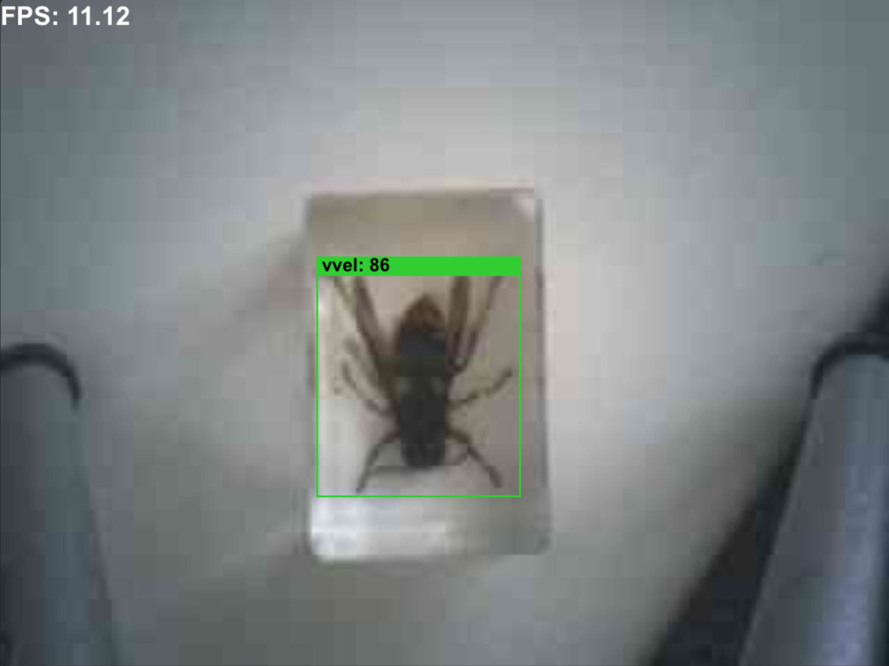

# GV2 YOLO11 Model Flashing Instructions

**Version 2026-04-28**
- GV2 firmware: I2C detection disabled to avoid conflicts on those pins (UART unchanged)
- ESP32 code: LED part removed

## Quick reference to flash YOLO11 models to Grove Vision AI V2 (on macOS) and validate the received inference result and jpg on the ESP32

### Setup

#### Hardware
- Grove Vision AI V2 (GV2) board
- ESP32-S3 
**Important:** if flashing the GV2 fails unplug ESP32 from the GV2 socket and try again
- USB-C cable to connect GV2 and ESP32 to the computer
- Python 3.11+ with virtual environment activated: `source .venv/bin/activate`

#### Software

- **Clone repo with submodules (all-in-one):** `git clone --recurse-submodules https://github.com/marcory-hub/vespa_smart_trap && cd vespa_smart_trap`
- **Or separately:** Clone first, then init: `git clone https://github.com/marcory-hub/vespa_smart_trap && cd vespa_smart_trap && git submodule update --init --recursive`
- **Create venv:** `python3 -m venv .venv && source .venv/bin/activate`
- **Install deps:** `pip install pyserial`

## Flash the GV2

1. **Connect GV2 with USB and identify USB port:** `ls /dev/cu.usbmodem*` (e.g., `/dev/cu.usbmodem58FA1047631`)
2. **Navigate to gv2_firmware folder:** `cd gv2_firmware`
3. **Run xmodem flash command:**
   ```bash
   python xmodem/xmodem_send.py \
     --port=PORT \
     --baudrate=921600 \
     --protocol=xmodem \
     --file=we2_image_gen_local/output_case1_sec_wlcsp/output.img \
     --model="model_zoo/tflm_yolo11_od/yolo11n_vespa_2026-02v1_allpxNULL_full_integer_quant_vela.tflite 0xB7B000 0x00000"
   ```
   Replace `PORT` with the USB port from step 1. Default model is yolo11n_vespa_2026-02v1_allpxNULL_full_integer_quant_vela.tflite, replace this part if an other model is needed.

4. **When prompted on GV2:** Press reset button; X-Modem will begin automatically
5. **Wait for completion:** Progress bar shows 100%, board reboots. (Trouble shooting: press reset button or unplug usb-c and plug it in again if inference does not start)

Expected output
```
Open Serial Port /dev/cu.usbmodemXXXXXXXX
Device init successfully
Please press reset button!!
b'1st BL Modem Build DATE=Nov 30 2023, 0x0002000b'
b'Please input any key to enter X-Modem mode in 100 ms'
b'waiting input key'
b'Set X-modem flag = Yes'
b''
b'slot flash_offset 0x00000000'
b'jump_addr=0x3401f000'
b'Compiler Version: ARM CLANG, Clang 13.0.0 (ssh://ds-gerrit/armcompiler/llvm-project 1f5770d6f72ee4eba2159092bbf4cbb819be323a)'
b'set_IP_secure done'
b'flash type[0], flash size[5]'
b'slot FlashOffset 0x00100000'
b'Image max size 0x00100000'
b'------------------------------------------------------------'
b'[0] Reboot system'
b'[1] Xmodem download and burn FW image'
b'------------------------------------------------------------'
b''
b'!!!!!!!!!!!!!!!!!!!!!!!!!!!!!!!!!!!!!!!!!!!!!!!!!!!!!!!!!!!!!!!!!!!'
b'!!  Please keep the power on during the program upgrade process  !!'
b'!!!!!!!!!!!!!!!!!!!!!!!!!!!!!!!!!!!!!!!!!!!!!!!!!!!!!!!!!!!!!!!!!!!'
b''
b''
b'Send data using the xmodem protocol from your terminal'
xmodem_sending >> we2_image_gen_local/output_case1_sec_wlcsp/output.img
[██████████████████████████████] 100.00% 2944/2944 error: 0

xmodem_send bin file done!!
generate _temp_model_0_preamble_data.bin for /Users/md/Developer/vespa_smart_trap/gv2_firmware/model_zoo/tflm_yolo11_od/yolo11n_vespa_2026-02v1_allpxNULL_full_integer_quant_vela.tflite preamble data
xmodem_sending >> _temp_model_0_preamble_data.bin
[██████████████████████████████] 100.00% 1/1 error: 0

xmodem_send bin file done!!
xmodem_sending >> /Users/md/Developer/vespa_smart_trap/gv2_firmware/model_zoo/tflm_yolo11_od/yolo11n_vespa_2026-02v1_allpxNULL_full_integer_quant_vela.tflite
[██████████████████████████████] 100.00% 16006/16006 error: 0

xmodem_send bin file done!!
xmodem_send bin file result =  True
b'\x06'
b''
b'Do you want to end file transmission and reboot system? (y)'

Firmware upgrade completed, restart WE2 ...
```
## Build and flash the ESP32-S3 
1. **Connect GV2 with USB and identify USB port:** `ls /dev/cu.usbmodem*` (e.g., `/dev/cu.usbmodem1101`)
2. **Navigate to esp32_firmware folder:** `cd esp_firmware/esp32-s3-gv2-uart-reciever`
3. **Build and flash the ESP:** `pio run -t upload`
expected output
```
Processing esp32s3-gv2-uart (platform: espressif32@6.3.0; board: seeed_xiao_esp32s3; framework: arduino)
--------------------------------------------------------------------------------
Verbose mode can be enabled via `-v, --verbose` option
CONFIGURATION: https://docs.platformio.org/page/boards/espressif32/seeed_xiao_esp32s3.html
PLATFORM: Espressif 32 (6.3.0) > Seeed Studio XIAO ESP32S3
HARDWARE: ESP32S3 240MHz, 320KB RAM, 8MB Flash
DEBUG: Current (cmsis-dap) External (cmsis-dap, esp-bridge, esp-builtin, esp-prog, iot-bus-jtag, jlink, minimodule, olimex-arm-usb-ocd, olimex-arm-usb-ocd-h, olimex-arm-usb-tiny-h, olimex-jtag-tiny, tumpa)
PACKAGES: 
 - framework-arduinoespressif32 @ 3.20009.0 (2.0.9) 
 - tool-esptoolpy @ 1.40501.0 (4.5.1) 
 - tool-mkfatfs @ 2.0.1 
 - tool-mklittlefs @ 1.203.210628 (2.3) 
 - tool-mkspiffs @ 2.230.0 (2.30) 
 - toolchain-riscv32-esp @ 8.4.0+2021r2-patch5 
 - toolchain-xtensa-esp32s3 @ 8.4.0+2021r2-patch5
LDF: Library Dependency Finder -> https://bit.ly/configure-pio-ldf
LDF Modes: Finder ~ chain, Compatibility ~ soft
Found 33 compatible libraries
Scanning dependencies...
No dependencies
Building in release mode
Retrieving maximum program size .pio/build/esp32s3-gv2-uart/firmware.elf
Checking size .pio/build/esp32s3-gv2-uart/firmware.elf
Advanced Memory Usage is available via "PlatformIO Home > Project Inspect"
RAM:   [=         ]   6.1% (used 20020 bytes from 327680 bytes)
Flash: [=         ]   8.0% (used 266473 bytes from 3342336 bytes)
Configuring upload protocol...
AVAILABLE: cmsis-dap, esp-bridge, esp-builtin, esp-prog, espota, esptool, iot-bus-jtag, jlink, minimodule, olimex-arm-usb-ocd, olimex-arm-usb-ocd-h, olimex-arm-usb-tiny-h, olimex-jtag-tiny, tumpa
CURRENT: upload_protocol = esptool
Looking for upload port...
Auto-detected: /dev/cu.usbmodem1101
Uploading .pio/build/esp32s3-gv2-uart/firmware.bin
esptool.py v4.5.1
Serial port /dev/cu.usbmodem1101
Connecting....
Chip is ESP32-S3 (revision v0.2)
Features: WiFi, BLE
Crystal is 40MHz
MAC: d8:3b:da:a4:41:28
Uploading stub...
Running stub...
Stub running...
Changing baud rate to 921600
Changed.
Configuring flash size...
Flash will be erased from 0x00000000 to 0x00003fff...
Flash will be erased from 0x00008000 to 0x00008fff...
Flash will be erased from 0x0000e000 to 0x0000ffff...
Flash will be erased from 0x00010000 to 0x00051fff...
Compressed 15040 bytes to 10333...
Writing at 0x00000000... (100 %)
Wrote 15040 bytes (10333 compressed) at 0x00000000 in 0.3 seconds (effective 445.6 kbit/s)...
Hash of data verified.
Compressed 3072 bytes to 146...
Writing at 0x00008000... (100 %)
Wrote 3072 bytes (146 compressed) at 0x00008000 in 0.1 seconds (effective 378.2 kbit/s)...
Hash of data verified.
Compressed 8192 bytes to 47...
Writing at 0x0000e000... (100 %)
Wrote 8192 bytes (47 compressed) at 0x0000e000 in 0.1 seconds (effective 590.3 kbit/s)...
Hash of data verified.
Compressed 266832 bytes to 149902...
Writing at 0x00010000... (10 %)
Writing at 0x0001c3d1... (20 %)
Writing at 0x00024687... (30 %)
Writing at 0x00029be0... (40 %)
Writing at 0x0002f117... (50 %)
Writing at 0x00034750... (60 %)
Writing at 0x0003cce9... (70 %)
Writing at 0x00044fd2... (80 %)
Writing at 0x0004a6f5... (90 %)
Writing at 0x0005040c... (100 %)
Wrote 266832 bytes (149902 compressed) at 0x00010000 in 1.8 seconds (effective 1187.2 kbit/s)...
Hash of data verified.

Leaving...
Hard resetting via RTS pin...
========================= [SUCCESS] Took 7.91 seconds =========================
```

## Inference validation

1. **Plug ESP32 in the GV2**
2. **Connect the ESP32 (or GV2) with USB-C:** either of them work
3. Optional: **monitor the inference:** `pio device monitor --filter printable -b 921600`

expected output
```
SENSORDPLIB_STATUS_XDMA_FRAME_READY 22 
{"type": 0, "name": "NAME?", "code": 0, "data": "kris Grove Vision AI (WE2)"}
{"type": 0, "name": "VER?", "code": 0, "data": {"software": "Thu Mar 12 22:30:26 2026", "hardware": "kris 2024"}}
{"type": 0, "name": "ID?", "code": 0, "data": 1}
{"type": 0, "name": "INFO?", "code": 0, "data": {"crc16_maxim": 65535, "info": ""}}
{"type": 0, "name": "MODEL?", "code": 0, "data": {"id": 0, "type": 0, "address": 1289219112, "size": 347533651}}
{"type": 1, "name": "INVOKE", "code": 0, "data": {"count": 0, "algo_tick": [[35979787]], "boxes": [[85, 112, 73, 82, 86, 3]], "image": "/9j/4AAQSkZJRgABAQEASABIAAD/2wBDABsSFBcUERsXFhceHBsgKEIrKCUlKFE6PTBCYFVlZF9VXVtqeJmBanGQc1tdhbWGkJ6jq62rZ4C8ybqmx5moq6T/2wBDARweHigjKE4rK06kbl1upKSkpKSkpKSkpKSkpKSkpKSkpKSkpKSkpKSkpKSkpKSkpKSkpKSkpKSkpKSkpKSkpKT/wAARCADwAUADASIAAhEBAxEB/8QAHwAAAQ
```
- "boxes": [[85, 112, 73, 82, 86, 3]] 
  - second value is the confidence scor in conf_u8 format (0-255) (confidence is conf_u8/255)
  - last value (3) is the class
4. Optional: **Check jpg** with the capture_gv2_uart_jpeg.py script (replace XXXX with the number of your ESP32 port number)
`python3 scripts/capture_gv2_uart_jpeg.py /dev/cu.usbmodemXXXX 921600`. This script captures the first detection and saves it to the root after it is started so you can check if the jpg is not corrupt.
5. Optional: **Check gv2 detection with Himax AI web toolkit:** open `Himax_AI_web_toolkit/index.html` (from vscode you can do it with the Live Server plugin). Select `grove vision ai (v2)` top right, select `connect`, select USB device and click make connection.
expected output



### Models in model_zoo:
- Available Models are located here: `gv2_firmware/model_zoo/tflm_yolo11_od/`
- Default model: `yolo11n_vespa_2026-02v1_allpxNULL_full_integer_quant_vela.tflite` (this model is trained on the complete dataset)
- Models we have to test with the field experiments (trained on a dataset were the smallest objects are removed):
  - `yolo11n_vespa_2026-02v1_30pxNULL_full_integer_quant_vela.tflite`
  - `yolo11n_vespa_2026-02v1_40pxNULL_full_integer_quant_vela.tflite`
  - `yolo11n_vespa_2026-02v1_60pxNULL_full_integer_quant_vela.tflite`
- Do not flash gv2 from the sensecraft website, the sensecraft model is a swift-yolo model (192x192 px) that has lower performance compared to the yolo11n models (224x224 px)