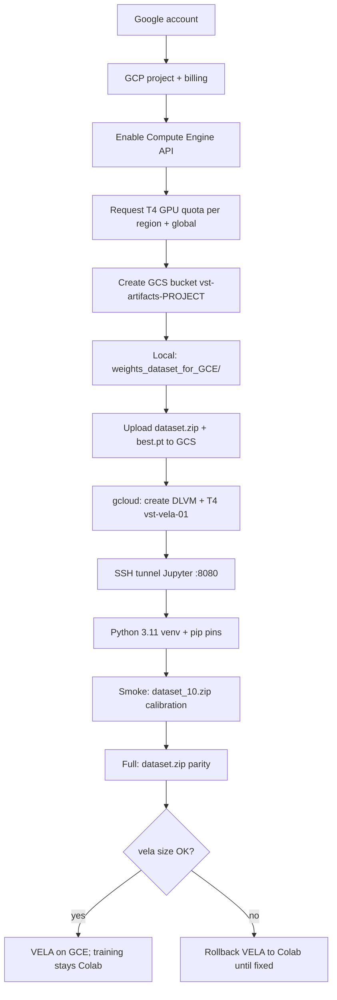

**One-line purpose:** research for migration made by cursor
**Short summary:** migration from colab to GCE
**Agent:** SoT
**Main Index:** [[__vespa_smart_trap]]
**Next:** [[vst prompt to migrate colab to VM CGE]]

---

# Research deliverable: Colab → GCE for VST training notebooks

## Research task

Define how a user-owned Google Cloud account and a GPU Compute Engine VM can run the two VST training notebooks (`YOLO11n_training_2026_02_19.ipynb`, `YOLO_pt_to_vela_2026_02_24.ipynb`) with parity to the current Colab workflow.

## Why this blocked build-prompt

There is no repo or `notes/` SoT for GCE setup, billing, GPU quota, data paths, or how to replace Colab-only APIs (`drive.mount`, `userdata`, `files.download`). The notebooks are written for Colab + Google Drive, not bare GCE.

**Note:** `notes/_hardware_vst.md`, `notes/_datasets_vst.md`, `notes/_model_vst.md`, and `notes/_timeline_vst.md` were not readable when this was written. Sync Obsidian (`notes/_cli_vst.md`) before `@build-prompt` if those paths are needed.

## Summary recommendation

**Cost-driven split (Addendum 4, 2026-06-11):** Keep **`YOLO11n_training_2026_02_19.ipynb` on Colab**. Colab T4 is roughly **5 to 10× cheaper** per GPU-hour than GCE `n1-highmem-8` + T4 on-demand. Migrate **`YOLO_pt_to_vela_2026_02_24.ipynb` to GCE** before Colab runtime **2025.07** EOL (~2026-07); that notebook is forced off Colab by runtime retirement, not by cost.

Use a **user-owned GCP project** with **billing enabled** (free trial cannot attach GPUs). Request **NVIDIA T4 quota** in one EU zone (e.g. `europe-west4-a`). Provision a **Deep Learning VM** with JupyterLab ([DLVM quickstart](https://cloud.google.com/deep-learning-vm/docs/create-vm-instance-gcloud), [Jupyter access](https://cloud.google.com/deep-learning-vm/docs/jupyter)). Replace Colab Drive paths with a **GCS bucket** (`gsutil cp` / `gsutil rsync`). Run the VELA notebook natively in JupyterLab (not Colab "connect to local runtime"), because [Drive mount does not work on GCE](https://research.google.com/colaboratory/intl/en-GB/faq.html).

**Python version is the main GCE risk:** VELA notebook requires Colab runtime **2025.07** (Python 3.11). Current DLVM PyTorch images ship **Python 3.12** (PyTorch 2.9) or **3.10** per [DLVM image list](https://docs.cloud.google.com/deep-learning-vm/docs/images). Plan a **dedicated Python 3.11 venv** on the VM before parity testing.

One VM suffices for **VELA-only** workload. Training on GCE remains a fallback if Colab runtime or pricing changes; it is not the default path.

## Decisions

|                      |                                                                                               |                                                                                                                                                      |            |
| -------------------- | --------------------------------------------------------------------------------------------- | ---------------------------------------------------------------------------------------------------------------------------------------------------- | ---------- |
| Topic                | Recommendation                                                                                | Source                                                                                                                                               | Confidence |
| Target notebooks     | `YOLO11n_training_2026_02_19.ipynb` (train), `YOLO_pt_to_vela_2026_02_24.ipynb` (int8 + VELA) | Cloned `colab-notebooks/`; Colab URLs are Drive copies of same repo                                                                                  | high       |
| GCP ownership        | User creates own Google account + GCP project + billing                                       | [DLVM quickstart prerequisites](https://cloud.google.com/deep-learning-vm/docs/create-vm-instance-gcloud)                                            | high       |
| GPU on free trial    | Not available; upgrade to paid billing before GPU quota request                               | [GCP quota docs](https://stackoverflow.com/questions/45227064/how-to-request-gpu-quota-increase-in-google-cloud)                                     | high       |
| GPU type             | `nvidia-tesla-t4,count=1` (matches notebook note: "T4 GPU", batch 395)                        | Training notebook cell 2; [GCE GPU docs](https://docs.cloud.google.com/compute/docs/gpus/create-gpu-vm-general-purpose)                              | high       |
| Machine type         | **Minimum:** `n1-standard-4` + T4 (VELA smoke/full). **Escalate:** `n1-standard-8`, then `n1-highmem-8` if INT8 export OOM | Addendum 6; VELA-only, not training batch 395 |
| VM image             | `pytorch-2-9-cu129-ubuntu-2204-nvidia-580` + `install-nvidia-driver=True`                     | [DLVM images](https://docs.cloud.google.com/deep-learning-vm/docs/images)                                                                            | medium     |
| Jupyter access       | `gcloud compute ssh jupyter@INSTANCE -- -L 8080:localhost:8080` then `http://localhost:8080`  | [DLVM Jupyter docs](https://cloud.google.com/deep-learning-vm/docs/jupyter)                                                                          | high       |
| Data store           | GCS bucket replaces Drive; local staging in `weights_dataset_for_GCE/`                        | Colab FAQ; user-provided parity bundle (Addendum 5)                                                                                                  | high       |
| Colab APIs to remove | `drive.mount`, `userdata.get`, `files.download`                                               | Notebook inspection                                                                                                                                  | high       |
| W&B secret           | Training Colab only (`userdata`). **Not used on GCE VELA path**                               | Addendum 4 cost split; user decision 2026-06-11                                                                                                      | high       |
| VELA stack           | `ethos-u-vela`, `himax_vela.ini`, `kris-himax/ultralytics`, pinned pip versions               | VELA notebook cells 4, 7, 10                                                                                                                         | high       |
| Output artifact      | `best_full_integer_quant_vela.tflite` ≤ 2.4 MB                                                | VELA notebook cell 14; project-context SRAM limit                                                                                                    | high       |
| Python 3.11          | Create pyenv/venv 3.11 on VM; do not rely on DLVM default 3.12                                | VELA notebook cell 1; `safety-guardrails.mdc`                                                                                                        | high       |
| Hybrid Colab+GCE UI  | Not recommended: Drive mount still broken                                                     | [Colab FAQ](https://research.google.com/colaboratory/intl/en-GB/faq.html), [colabtools #2941](https://github.com/googlecolab/colabtools/issues/2941) | high       |
| Cost control         | Stop VM when idle; delete test VMs; optional scheduled stop                                   | GCE `instances stop/delete`                                                                                                                          | high       |
| Rollback             | Keep Colab notebooks on Drive unchanged; GCE is parallel trial                                | `vst-topics.md`                                                                                                                                      | high       |

## Notebook → GCE mapping

### `YOLO11n_training_2026_02_19.ipynb`

|   |   |
|---|---|
|Colab step|GCE equivalent|
|`drive.mount`|Skip; use GCS or local `~/vst/data/`|
|Copy `dataset.zip` from Drive|`gsutil cp gs://BUCKET/dataset.zip ~/vst/` then `unzip`|
|`userdata.get('wandb-key')`|`os.environ["WANDB_API_KEY"]` from env|
|Train to `/content/dataset/data.yaml`|Same layout under `~/vst/dataset/`|
|Backup to Drive|`gsutil -m rsync -r ./vst_2026-05v2_top gs://BUCKET/runs/...`|
|`files.download(zip)`|`gsutil cp` to bucket or `scp` to laptop|

Pinned deps: `ultralytics==8.4.14`, `wandb==0.27.0`, `numpy==2.0.2`.

### `YOLO_pt_to_vela_2026_02_24.ipynb`

|                                      |                                            |
| ------------------------------------ | ------------------------------------------ |
| Colab step                           | GCE equivalent                             |
| Runtime 2025.07                      | Python 3.11 venv (mandatory parity target) |
| `dataset.zip` + `best.pt` from Drive | From `weights_dataset_for_GCE/` → GCS → `~/vst/` (see Addendum 5) |
| `kris-himax/ultralytics` clone       | Same on VM                                 |
| `yolo export ... int8`               | GPU step; same command                     |
| `ethos-u-vela` + `himax_vela.ini`    | Same; CPU-ok                               |
| Size check ≤ 2.4 MB                  | Same                                       |
| `files.download` zip                 | `gsutil cp` artifact to bucket             |

## User onboarding sequence (account → VM → notebooks)



## Bootstrap commands (no secrets)

```bash
# 0) Local: install gcloud, login
# https://cloud.google.com/sdk/docs/install

gcloud auth login
export PROJECT_ID=YOUR_PROJECT_ID
gcloud config set project ${PROJECT_ID}

# 1) Enable APIs
gcloud services enable compute.googleapis.com storage.googleapis.com

# 2) Create bucket (region near VM)
export REGION=europe-west4
export BUCKET=vst-artifacts-${PROJECT_ID}
gsutil mb -l ${REGION} gs://${BUCKET}/

# 3) Upload inputs (repo root; gitignored + cursorignored)
gsutil cp weights_dataset_for_GCE/best.pt gs://${BUCKET}/input/
gsutil cp weights_dataset_for_GCE/dataset_10.zip gs://${BUCKET}/input/
gsutil cp weights_dataset_for_GCE/dataset.zip gs://${BUCKET}/input/

# 4) Request GPU quota (Console): IAM → Quotas
# Filter: Compute Engine API → NVIDIA T4 GPUs → region + "GPUs (all regions)"
# Billing must be active; free trial cannot request GPU quota.

# 5) Create Deep Learning VM with T4 (minimum VELA shape)
export ZONE=europe-west4-a
export INSTANCE_NAME=vst-vela-01
export IMAGE_FAMILY=pytorch-2-9-cu129-ubuntu-2204-nvidia-580

gcloud compute instances create ${INSTANCE_NAME} \
  --zone=${ZONE} \
  --machine-type=n1-standard-4 \
  --image-family=${IMAGE_FAMILY} \
  --image-project=deeplearning-platform-release \
  --maintenance-policy=TERMINATE \
  --accelerator="type=nvidia-tesla-t4,count=1" \
  --boot-disk-size=100GB \
  --metadata="install-nvidia-driver=True"

# 6) Jupyter tunnel (use jupyter@ for home dir)
gcloud compute ssh jupyter@${INSTANCE_NAME} --zone=${ZONE} -- -L 8080:127.0.0.1:8080
# Browser: http://localhost:8080

# 7) On VM: workspace + data
mkdir -p ~/vst
gsutil cp gs://${BUCKET}/input/dataset_10.zip ~/vst/
gsutil cp gs://${BUCKET}/input/dataset.zip ~/vst/
gsutil cp gs://${BUCKET}/input/best.pt ~/vst/
cd ~/vst && unzip -q dataset_10.zip -d dataset_10
cd ~/vst && unzip -q dataset.zip -d dataset

# 8) Python 3.11 venv (do NOT use plain apt on DLVM Ubuntu 22.04/24.04)
# Ubuntu 22.04 ships 3.10; DLVM pytorch-2-9 images ship 3.12. Neither has python3.11 in default repos.
#
# Option A: pyenv (works on any DLVM image)
# curl https://pyenv.run | bash
# export PATH="$HOME/.pyenv/bin:$PATH" && eval "$(pyenv init -)"
# pyenv install 3.11.9
# ~/.pyenv/versions/3.11.9/bin/python -m venv ~/vst/.venv
# source ~/vst/.venv/bin/activate
#
# Option B: deadsnakes PPA (Ubuntu only)
# sudo add-apt-repository -y ppa:deadsnakes/ppa
# sudo apt-get update && sudo apt-get install -y python3.11 python3.11-venv
# python3.11 -m venv ~/vst/.venv && source ~/vst/.venv/bin/activate

# 9) Stop when idle (saves cost)
gcloud compute instances stop ${INSTANCE_NAME} --zone=${ZONE}

# 10) Teardown
# WARNING: Irreversible operation. Data loss/Overwrite risk.
# gcloud compute instances delete ${INSTANCE_NAME} --zone=${ZONE}
```

## Parity checklist (minimum before cutover)

**Smoke (10-image calibration, no training epochs):**

- `nvidia-smi` shows T4 on VM
- Python 3.11 active in venv (`python --version`)
- `best.pt` + `dataset_10/` on VM; INT8 export + VELA completes
- `best_full_integer_quant_vela.tflite` exists and ≤ 2.4 MB

**Full parity:**

- Same checks with full `dataset.zip`
- Size and val metrics within expected delta vs last Colab VELA run

**GV2 handoff:**

- Download artifact from GCS to `gv2_firmware/model_zoo/tflm_yolo11_od/`
- Flash via `@flash-gv2`; verify INVOKE / `@model-test`
- Deploy `*_vela.tflite` only (not raw `int8.tflite`)
    

## Paste into build-prompt

**Background**

- Migration: **VELA notebook only** → user-owned GCE Deep Learning VM + JupyterLab. **Training stays on Colab** (Addendum 4 cost gate).

- Notebooks: VELA (`YOLO_pt_to_vela_2026_02_24.ipynb`) on GCE; training (`YOLO11n_training_2026_02_19.ipynb`) on Colab.

- Success: same artifacts as Colab (`best_full_integer_quant_vela.tflite` ≤ 2.4 MB); VELA without `google.colab.*`; inputs from `weights_dataset_for_GCE/` → GCS (Addendum 5).

- Non-goals: GCE training by default; local Mac training/VELA; inference on T-SIM; changing YOLO architecture.
    

**Environment**

- User brings own GCP account, billing, GPU quota.
    
- Data via GCS bucket, not Drive.
    
- Secrets: no W&B on VELA path; no keys in repo.
    
- Python 3.11 venv required (Colab 2025.07 parity); DLVM default may be 3.12.
    

**GCE**

- DLVM PyTorch GPU image, T4, **minimum `n1-standard-4`**, 100 GB disk, EU `europe-west4-a`. Instance **`vst-vela-01`**. Escalate RAM on OOM (Addendum 6).
    
- Jupyter via SSH port 8080 as user `jupyter@`.
    
- Idle stop + documented teardown.
    
- Rollback: keep Colab notebooks unchanged.
    

**Hardware (downstream)**

- GV2 SRAM < 2.4 MB; flash `int8_vela.tflite` only.
    
- Resolution 224 per hardware note.
    

**Verification**

- **Smoke:** 10-image calibration subset (`dataset_10.zip`); full INT8 + VELA on GCE; output ≤ 2.4 MB.

- **Full:** full `dataset.zip` parity vs last Colab VELA run before 2025.07 EOL.

- **GV2:** download `best_full_integer_quant_vela.tflite` → `gv2_firmware/model_zoo/tflm_yolo11_od/` → `@flash-gv2`.

- Training: continue on Colab only; no GCE training parity.

- Must not break: `@sync-colab-notebooks`; Colab training notebook unchanged.
    

## Remaining `[to be verified]`

- Exact EU region/zone once user knows quota approval and dataset residency needs
    
- Python 3.11 install path on chosen DLVM image: pyenv (default) or deadsnakes PPA; plain `apt install python3.11` will fail
    
- Whether `numpy==2.0.2` + `ultralytics==8.4.14` run cleanly on Python 3.11 outside Colab 2025.07. If not than this notebook kan stay on colab and only the quant_vela can be done in CGE
    
- Optimal `batch` on GCE T4 (395 was Colab-specific; training stays Colab)
    
- Whether `dataset_10.zip` exists or must be created from full dataset (10 labeled images)
    
- Contents of `notes/_datasets_vst.md` (current dataset version)
    
- GPU quota approval timeline for new accounts (often 24 to 48 h, sometimes longer)
    
- Whether `n1-standard-4` + T4 is enough for full-dataset INT8 export (not just 10-image smoke)
    

## Scoping questions for `@build-prompt` (answer in next chat)

1. **Region:** EU-only (GDPR) or lowest-cost US zone acceptable?
    
2. **Scope:** Both notebooks on one VM, or separate train vs VELA VMs?
    
3. **Deliverable:** GCE runbook in `notes/` only, or also a `gce/` notebook variant in `marcory-hub/Seeed_Grove_Vision_AI_Module_V2`?
    

## Next step

1. Paste or copy from this file into Obsidian.
    
2. Sync missing `notes/` paths.
    
3. New chat → `@build-prompt` with this note attached.
    
4. After the plan is saved → `@grill-me` before any implementation.
    

---

## Key Colab-only cells to plan around

Training notebook depends on Drive + Colab secrets:

```python
from google.colab import drive
drive.mount('/content/drive')
# ...
from google.colab import userdata
os.environ["WANDB_API_KEY"] = userdata.get('wandb-key')
```

VELA notebook hard-requires Colab 2025.07:

```markdown
## IMPORTANT: Use runtime 2025.07!
```

Both assume Drive paths like `/content/drive/MyDrive/dataset.zip` and `/content/drive/MyDrive/best.pt`. On GCE, standardize on `~/vst/` + `gs://` and treat `/content` as a notebook path alias only if you add a thin adapter cell at the top.

## Colab notebook URLs (user-provided)

- Training: [https://colab.research.google.com/drive/1TGsNgTjzIeN_jRtQZf-Y3opKIXQ82djo](https://colab.research.google.com/drive/1TGsNgTjzIeN_jRtQZf-Y3opKIXQ82djo)
    
- VELA: [https://colab.research.google.com/drive/1rfAL67MIBLsjftxDs_TmneLN9IPntXIq](https://colab.research.google.com/drive/1rfAL67MIBLsjftxDs_TmneLN9IPntXIq)
    

GitHub SoT: [https://github.com/marcory-hub/Seeed_Grove_Vision_AI_Module_V2](https://github.com/marcory-hub/Seeed_Grove_Vision_AI_Module_V2) (`main`)

---

# Research addendum: local Mac run of `YOLO_pt_to_vela_2026_02_24.ipynb`

## Research task

Determine whether the VELA notebook can run locally on MacBook Air M5 and Mac mini M2 (not Colab, not GCE).

## Short answer

|   |   |   |
|---|---|---|
|Machine|Run full notebook as-is?|Practical recommendation|
|**Mac mini M2** (16 GB+)|**Maybe**, with notebook edits|Best local Mac candidate: thermals, power, RAM|
|**MacBook Air M5** (16 GB+)|**Maybe**, with notebook edits|Feasible for export + VELA; long val runs may throttle|
|Either with **8 GB RAM**|**Unlikely** for full notebook|INT8 export + full val split risks swap/OOM|

**VELA compile (`ethos-u-vela`)**: yes on both Macs (official macOS support per [ethos-u-vela PyPI](https://pypi.org/project/ethos-u-vela/)).

**INT8 TFLite export (`no_post=True` via `kris-himax/ultralytics`)**: highest risk. Himax documents Colab; no Mac runbook in repo. This step is the usual blocker.

**Project SoT note:** `project-context.mdc` still says no local train/quant/VELA. This section is feasibility research only; Colab/GCE remain the supported path until you explicitly change that policy.

## Notebook pipeline by step

|   |   |   |   |   |
|---|---|---|---|---|
|Step|Cells|Needs GPU?|Mac M-series?|Notes|
|Drive mount|2|no|Replace|Use local paths: `~/vst/dataset.zip`, `~/vst/best.pt`|
|Unzip + copy `best.pt`|3|no|Yes||
|`onnx==1.17.0`, `onnxruntime==1.26.0`, `tensorflow==2.18.0`|4|no|Yes|TF 2.18 has arm64 wheels; use **Python 3.11** venv ([TF install](https://www.tensorflow.org/install/pip))|
|Calibration subset (500 imgs)|5|no|Yes|Fix path: notebook writes `data.yaml` but prints `temp_data.yaml`|
|`kris-himax/ultralytics` install|7|no|Yes|Required for `no_post=True` export flag|
|`yolo export ... int8 no_post imgsz=224`|8|optional|**Risky**|Uses onnx2tf/TF chain; fragile outside Colab 2025.07 ([ultralytics #19292](https://github.com/ultralytics/ultralytics/issues/19292))|
|`pip install ethos-u-vela` + `himax_vela.ini`|10|no|Yes|CPU-only compiler|
|`vela --accelerator-config ethos-u55-64 ...`|12|no|Yes|Produces `best_full_integer_quant_vela.tflite`|
|Size check ≤ 2.4 MB|14|no|Yes||
|`model.val()` PT + TFLite + plots|16–17|optional|Yes, slower|PyTorch can use `device=mps`; TFLite val is CPU-heavy|
|Zip + download|19|no|Yes|Replace `files.download` with local zip|

## MacBook Air M5 vs Mac mini M2

|   |   |   |
|---|---|---|
|Factor|Mac mini M2|MacBook Air M5|
|Architecture|Apple Silicon arm64|Apple Silicon arm64 `[M5 specs to be verified]`|
|Unified memory|Often 16–24 GB in dev setups|Often 8/16/24 GB depending on SKU|
|Sustained load|Better (desktop, fan)|Worse (fanless throttle on long export/val)|
|Neural Engine / MPS|Helps PyTorch `.pt` val|Likely faster than M2; export still TF-bound|
|Disk|Usually fine|Fine if dataset.zip fits free space|

**Recommendation:** Mac mini M2 with **16 GB+** is the safer local machine. Air M5 is fine for occasional runs if RAM ≥ 16 GB and you accept longer, hotter sessions.

## What blocks "run notebook unchanged"

1. **`google.colab.*`** (`drive`, `files`) — not available locally.
    
2. **`runtime 2025.07` / Python 3.11** — mandatory per notebook + `safety-guardrails.mdc`. Do not use system Python 3.13 (no TF wheels).
    
3. **`kris-himax/ultralytics` + `no_post=True`** — not in stock Ultralytics; must clone and `pip install .` from [kris-himax/ultralytics](https://github.com/kris-himax/ultralytics).
    
4. **INT8 export** — depends on TensorFlow + onnx2tf; known Colab/Python sensitivity. Use CLI export (notebook uses CLI, which is good). Try `device=cpu` if export fails.
    
5. **Himax does not document Mac** — [YOLO11_on_WE2](https://github.com/HimaxWiseEyePlus/YOLO11_on_WE2) and [YOLOv8_on_WE2](https://github.com/HimaxWiseEyePlus/YOLOv8_on_WE2) point to Colab or generic Python agent, not Apple Silicon.
    

## What works well on Mac

- **VELA compiler** after you have `best_full_integer_quant.tflite` ([ethos-u-vela](https://pypi.org/project/ethos-u-vela/): macOS supported; needs Xcode CLI tools if wheel missing).
    
- **Post-export validation** (mAP tables, confusion matrix) if RAM suffices.
    
- **Split workflow:** if you already have `best_full_integer_quant.tflite` from Colab, Mac can run **cells 10–19 only** (VELA + checks) with high confidence.
    

## Suggested local setup (if you trial on Mac)

```bash
# Prerequisites: Xcode CLI tools
xcode-select --install

# Python 3.11 only (not 3.13)
python3.11 -m venv ~/vst-vela/.venv
source ~/vst-vela/.venv/bin/activate
pip install -U pip

# Notebook-pinned stack
pip install onnx==1.17.0 onnxruntime==1.26.0 tensorflow==2.18.0 pandas

# Himax ultralytics fork (no_post export)
git clone https://github.com/kris-himax/ultralytics ~/vst-vela/ultralytics
pip install ~/vst-vela/ultralytics

# Vela
pip install ethos-u-vela
curl -LO https://raw.githubusercontent.com/HimaxWiseEyePlus/ML_FVP_EVALUATION/main/vela/himax_vela.ini

# Layout (replace /content)
mkdir -p ~/vst-vela/dataset
# place dataset.zip, best.pt here; unzip dataset

# Export (from ~/vst-vela)
yolo export model=best.pt format=tflite int8=True no_post=True imgsz=224 data=dataset/data.yaml device=cpu

# Vela
vela --accelerator-config ethos-u55-64 \
  --config himax_vela.ini \
  --system-config My_Sys_Cfg \
  --memory-mode My_Mem_Mode_Parent \
  --output-dir ./best_saved_model \
  ./best_saved_model/best_full_integer_quant.tflite
```

## Decisions

|   |   |   |   |
|---|---|---|---|
|Topic|Recommendation|Source|Confidence|
|Full notebook on Mac|Possible with edits; not guaranteed first try|Notebook cells; Himax gaps|medium|
|VELA-only on Mac|Yes, if int8 tflite already exists|ethos-u-vela PyPI|high|
|INT8 export on Mac|Trial on Mac mini M2 16GB+ first; keep Colab fallback|ultralytics #19292; notebook pins|medium|
|Python version|3.11 venv required|Notebook metadata 2025.07; project rules|high|
|Mac mini vs Air|Prefer Mac mini for sustained export/val|Thermal/RAM reasoning|medium|
|M5-specific|Treat as arm64 like M2; verify RAM SKU|`[to be verified]`|low|
|Project policy|Colab/GCE still SoT until user overrides|`project-context.mdc`|high|

## Parity checklist (local Mac trial)

- `python --version` → 3.11.x
    
- `vela --version` works
    
- `yolo export ... no_post=True` produces `best_full_integer_quant.tflite`
    
- `vela` output ≤ 2.4 MB
    
- Byte-compare or flash-test `*_vela.tflite` on GV2 vs last Colab artifact
    

## Remaining `[to be verified]`

- Whether `no_post=True` export succeeds on Mac arm64 with exact notebook pins
    
- MacBook Air M5 RAM configuration (8 vs 16 vs 24 GB)
    
- Dataset zip size vs available disk/RAM on each machine
    
- Whether exported Mac artifact matches Colab byte-for-byte or only metric-parity
    
- `tensorflow-metal` needed or harmful for this export path (export may be CPU-only)
    

## Paste into build-prompt (Mac section)

- **Local Mac trial:** optional fallback for VELA notebook only; Mac mini M2 16GB+ preferred.
    
- **Scope:** adapt notebook Colab cells to `~/vst-vela/` paths; Python 3.11 venv; no `google.colab`.
    
- **Split path:** Colab/GCE for int8 export if Mac export fails; Mac for VELA compile only.
    
- **Non-goal:** override project "no local VELA" without explicit user approval.
    

---

# Addendum 2: why Python 3.11 is required

The VELA notebook pins Colab runtime **2025.07**, which ships Python **3.11** (`YOLO_pt_to_vela_2026_02_24.ipynb` metadata). Project rules lock training export to that stack (`safety-guardrails.mdc`).

The INT8 TFLite export path (`tensorflow==2.18.0`, `onnx2tf`, `kris-himax/ultralytics` with `no_post=True`) is sensitive to Python and dependency versions. Colab 2025.07 is the only environment where this notebook is known to work; Python 3.12 on current DLVM images and 3.10 on stock Ubuntu are unverified and have caused export failures elsewhere ([ultralytics #19292](https://github.com/ultralytics/ultralytics/issues/19292)).

**Bottom line:** match Colab 2025.07 with a 3.11 venv on GCE. Do not assume the DLVM default Python is sufficient. Per-package 3.12 analysis: see Addendum 3.

---

# Addendum 3: Python 3.12 compatibility (kris-himax stack)

Research date: 2026-06-11. PyPI wheel checks + `kris-himax/ultralytics` `exporter.py` dependency pins.

## NumPy is not a 3.12 blocker

`numpy==2.0.2` (training notebook pin) ships `cp312` wheels on PyPI. The project locks to Python 3.11 for **stack parity** with Colab 2025.07, not because NumPy lacks 3.12 support.

## Explicitly pinned packages (notebooks)

|   |   |   |
|---|---|---|
|Library|Pin|Python 3.12?|
|`tensorflow`|`2.18.0`|Yes (official 3.9 to 3.12)|
|`onnx`|`1.17.0`|Yes (`cp312` wheels)|
|`onnxruntime`|`1.26.0`|Yes (`cp312` wheels)|
|`numpy`|`2.0.2` (training nb)|Yes (`cp312` wheels)|
|`ultralytics`|`8.4.14` (training)|Declares 3.12; source install|
|`kris-himax/ultralytics`|fork (VELA)|Same as upstream|
|`ethos-u-vela`|unpinned|Yes (`cp312` wheels)|
|`wandb`|`0.27.0` (training)|Universal wheel|

## Auto-pulled by kris-himax TFLite export (`exporter.py`)

|   |   |   |
|---|---|---|
|Library|Pin in fork|Python 3.12?|
|`onnx2tf`|`>1.17.5,<=1.22.3`|Source-only at 1.22.3; should install on 3.12|
|`keras`|auto|Source-only|
|`tf_keras`|auto|Source-only|
|`sng4onnx`|`>=1.0.1`|Source-only|
|`onnx_graphsurgeon`|`>=0.3.26`|NVIDIA package; wheel availability version-dependent `[to be verified]`|
|`onnxslim`|`>=0.1.31`|Source-only|
|`tflite_support`|unpinned (non-Jetson)|**Risk: see below**|
|`flatbuffers`|`>=23.5.26,<100`|Source-only|

## Libraries that do not work (or are risky) on Python 3.12

### Confirmed wheel gap

|   |   |
|---|---|
|Library|Issue|
|**`tflite_support` 0.4.4**|Has `cp311` wheels, **no `cp312` wheels** on PyPI. The kris-himax exporter installs `tflite_support` unpinned on Linux/GCE; pip may pull 0.4.4 and fail on 3.12. Jetson path pins `<=0.4.3` instead.|

**GCE workaround (if testing on 3.12 anyway):** pin before export:

```bash
pip install "tflite_support<=0.4.3"
```

### Optional ultralytics deps excluded on 3.12+ (not used in VELA path)

|   |   |
|---|---|
|Library|Issue|
|`coremltools`|Only installed when `python_version <= '3.11'` in `pyproject.toml`|
|`scikit-learn` (CoreML quant)|Same `<=3.11` guard|

Irrelevant to `yolo export format=tflite int8 no_post=True`.

### Version trap (opposite direction)

|   |   |
|---|---|
|Library|Issue|
|`onnx2tf` >= 2.0.0|Requires `>=3.12` (will not run on 3.11). **Not used** by kris-himax, which caps at `<=1.22.3`.|

## Stack-level risk (main reason to stay on 3.11)

There is no complete list of libraries that definitively break on 3.12. Individual pins mostly install. The documented risk is the **entire INT8 export chain** (`tensorflow` + `onnx2tf` + `no_post=True`) being unverified on 3.12:

- Colab 2025.07 (3.11) is the only known-good environment.
    
- Export failures are version-sensitive ([ultralytics #19292](https://github.com/ultralytics/ultralytics/issues/19292)).
    
- `onnx2tf` 1.22.3 is pinned for 3.11 parity; 2.x needs 3.12 but is outside the fork pin.
    

## Summary

|   |   |
|---|---|
|Question|Answer|
|Is NumPy a 3.12 problem?|No|
|Hard 3.12 wheel gap?|`tflite_support` 0.4.4 only (pin `<=0.4.3` if testing 3.12)|
|Why use 3.11 on GCE?|Colab 2025.07 parity + unverified export chain on 3.12|
|DLVM default 3.12?|Do not use for VELA parity; pyenv/deadsnakes 3.11 venv (see bootstrap step 8)|

---

# Addendum 4: training cost comparison (Colab vs GCE)

Research date: 2026-06-11. Purpose: decide whether **`YOLO11n_training_2026_02_19.ipynb`** should migrate to GCE or stay on Colab.

## Short answer

| Notebook | Stay on Colab? | Why |
| :--- | :--- | :--- |
| **`YOLO11n_training_2026_02_19.ipynb`** | **Yes** | Colab T4 GPU-hour cost is **~5 to 10× lower** than GCE `n1-highmem-8` + T4 on-demand. Training workflow (Drive, W&B, `userdata`) already works. |
| **`YOLO_pt_to_vela_2026_02_24.ipynb`** | **No (migrate to GCE)** | Colab runtime **2025.07** EOL (~2026-07) forces migration regardless of cost. GCE cost per run is acceptable at VST cadence (see below). |

**Decision rule:** If Colab is cheaper for training, training stays on Colab. Cost research confirms Colab is cheaper. GCE migration scope defaults to **VELA export + compile only**.

## VST workload assumptions

From project notebooks and notes (verified this session):

| Parameter | Value | Source |
| :--- | :--- | :--- |
| Model | YOLO11n | `notes/_model_vst.md`, research doc |
| Training config | 300 epochs, batch 395, imgsz 224 | Research doc; W&B run `yolo11n_top_e300_b395` |
| Train split size | ~330 images (top-down dataset) | `notes/_timeline_vst.md` (2026-05-14) |
| GPU class | NVIDIA T4 | Training notebook; Colab high-RAM T4 |
| GCE shape (if used) | `n1-highmem-8` + 1× T4, 200 GB disk, `europe-west4-a` | Research doc bootstrap |
| VELA pipeline | INT8 export (GPU) + `ethos-u-vela` (CPU) | VELA notebook mapping |

### GPU hours per run `[to be verified]`

Exact wall time was not readable from W&B in this session. Estimates from dataset size (small), `imgsz=224`, and `batch=395` (one batch per epoch):

| Job | Estimated GPU time | Confidence |
| :--- | :--- | :--- |
| Full training (300 epochs) | **2 to 8 hours** | medium |
| 10-epoch smoke test | **0.5 to 1.5 hours** | medium |
| VELA notebook (export + val) | **1 to 3 hours** GPU + CPU | medium |

Record actual hours from the next Colab run (W&B `_runtime` or notebook timestamps) and update this table.

## Colab pricing (T4)

Sources: [Colab signup / PAYG](https://colab.research.google.com/signup), [Colab FAQ](https://research.google.com/colaboratory/intl/en-GB/faq.html), [McCormick GPU cost table (2026-03-10)](https://mccormickml.com/2024/04/23/colab-gpus-features-and-pricing/).

| Item | Price | Notes |
| :--- | :--- | :--- |
| Compute unit (CU) | **$0.10 / CU** ($9.99 per 100 CU) | PAYG or bundled with Pro |
| Colab Pro | **$9.99 / month** | Includes 100 CU/month |
| Colab Pro+ | **$49.99 / month** | 600 CU/month; background execution up to 24 h |
| T4 burn rate | **~1.19 CU/hr** → **~$0.12/hr** | McCormick measurement, 2026-03-10; Google does not publish fixed rates |
| T4 burn rate (alt.) | **~1.96 CU/hr** → **~$0.20/hr** | Community reports; treat as upper bound `[to be verified]` |
| Free tier | **$0** | T4 not guaranteed; 12 h max session; idle disconnect risk for long jobs |

**Colab caveats:** CU burn varies by GPU, region, and demand ([Colab FAQ](https://research.google.com/colaboratory/intl/en-GB/faq.html)). Environment setup and idle time also consume CUs on paid tiers. For 300-epoch runs, Pro+ background execution reduces disconnect risk.

## GCE pricing (T4 + VM)

Sources: [GCP Agent Platform pricing](https://cloud.google.com/products/gemini-enterprise-agent-platform/pricing) (Compute Engine SKU table, us-central1), [Compute Engine billing model](https://cloud.google.com/products/compute/pricing), [GPU Finder](https://gpufinder.dev/providers/google-cloud) (cross-check, 2026-06-11).

| Component | On-demand (USD/hr) | Region | Source |
| :--- | :--- | :--- | :--- |
| `n1-highmem-8` VM | **$0.548** | us-central1 | GCP SKU table |
| NVIDIA Tesla T4 (attached) | **$0.525** | us-central1 | GCP SKU table |
| **Combined VM + T4** | **~$1.07 / hr** | us-central1 | sum of above |
| `n1-standard-8` + 1× T4 | **~$0.36 / hr** | europe-west4 | GPU Finder aggregate `[cross-check only]` |
| EU premium | **+5 to 15%** | europe-west4 | Typical vs us-central1 `[estimate]` |

**GCE `n1-highmem-8` + T4 in EU (planning figure): ~$1.10 to $1.25 / hr on-demand.**

Additional GCE costs:

| Item | Typical cost | Notes |
| :--- | :--- | :--- |
| 200 GB boot disk (pd-standard) | **~$8 / month** if VM exists (stopped or running) | Billed while disk exists |
| GCS storage | **~$0.02 / GB / month** (Standard, EU) | `dataset.zip`, artifacts |
| GCS egress to laptop | **~$0.12 / GB** (first tier) | One-time per download |
| GPU quota / setup | **$0** compute | Operator time; 24 to 48 h quota wait `[to be verified]` |

**GCE cost control:** `gcloud compute instances stop` when idle. On-demand billing continues for attached disk; delete test VMs when done.

**Spot/preemptible:** 60 to 91% discount possible ([Compute pricing](https://cloud.google.com/products/compute/pricing)), but preemption mid-training is unacceptable for unattended 300-epoch jobs unless checkpoint/resume is proven.

## Per-run cost scenarios (USD)

Using **4 GPU-hours** as a conservative mid estimate for one full training run, and **2 GPU-hours** for one VELA pipeline run.

| Scenario | Colab T4 @ $0.12/hr | Colab T4 @ $0.20/hr (upper) | GCE @ $1.15/hr (EU highmem+T4) |
| :--- | :--- | :--- | :--- |
| Full training (4 h) | **$0.48** | **$0.80** | **$4.60** |
| VELA pipeline (2 h) | **$0.24** | **$0.40** | **$2.30** |
| Smoke test (1 h) | **$0.12** | **$0.20** | **$1.15** |

### Annual cadence (illustrative)

Assume **12 training runs** + **12 VELA runs** per year (~monthly iteration):

| Platform | Compute only (12× train + 12× VELA) | With Colab Pro subscription |
| :--- | :--- | :--- |
| **Colab** (train + VELA on Colab) | **~$8.64** at $0.12/hr (72 GPU-h total) | **~$128 / yr** ($9.99×12 + overage unlikely at this cadence) |
| **Split (recommended)** | Train Colab + VELA GCE: **~$34 / yr** ($5.76 Colab train + ~$28 GCE VELA) | **~$154 / yr** with Pro |
| **Full GCE** (both notebooks) | **~$83 / yr** | N/A |

Colab Pro's **100 CU/month** (~84 h T4 at 1.19 CU/hr) covers VST training cadence with large headroom. GCE only wins on cost if the VM is **stopped immediately** after short jobs and Colab CU rates spike; at list on-demand rates it does not.

## Non-cost factors (still favor split)

| Factor | Colab (training) | GCE (VELA) |
| :--- | :--- | :--- |
| Runtime 2025.07 / Python 3.11 | Available today on Colab | Requires pyenv/deadsnakes venv on DLVM |
| Session limits | 12 to 24 h; disconnect risk | No Colab timeout; operator must stop VM |
| Drive + W&B integration | Native (`drive.mount`, `userdata`) | GCS + env var migration |
| Reproducibility / audit | Shared Colab runtime | User-owned project, fixed VM config |
| Colab 2025.07 EOL | Training notebook may work on newer runtime `[to be verified]` | Required path for VELA parity stack |

Training notebook deps (`ultralytics==8.4.14`, `wandb`, `numpy==2.0.2`) are less fragile than the VELA INT8 export chain (Addendum 2 and 3). Lower urgency to move training off Colab before EOL.

## Decisions

| Topic | Recommendation | Confidence |
| :--- | :--- | :--- |
| Training notebook location | **Stay on Colab** | high |
| VELA notebook location | **Migrate to GCE** before 2025.07 EOL | high |
| GCE VM sizing for VELA-only | **`n1-standard-4` + T4** minimum; escalate on OOM (Addendum 6) | high |
| Colab tier for long trains | Pro or Pro+ if free tier disconnects during 300 epochs | medium |
| Revisit training migration | Only if Colab drops T4, CU price exceeds GCE, or 2025.07 EOL breaks training deps | high |

## Paste into build-prompt (cost section)

- **Cost gate:** Training stays on Colab because T4 GPU-hour is ~5 to 10× cheaper than GCE on-demand.
- **Migration scope:** GCE runbook targets **VELA notebook only** by default; training notebook remains Colab SoT.
- **Artifact handoff:** `weights_dataset_for_GCE/best.pt` + `weights_dataset_for_GCE/dataset.zip` → GCS → GCE VELA notebook (Addendum 5).
- **Budget check:** One VELA run ≈ $2 to 3 GCE; one training run ≈ $0.50 Colab vs ≈ $5 GCE.
- **Verify:** Log GPU wall time on next W&B run; update Addendum 4 estimates.

## Remaining `[to be verified]`

- Actual W&B runtime for `yolo11n_top_e300_b395_20260528_092737`
- Whether training notebook runs on Colab runtime after 2025.07 retirement without edits
- Current T4 CU burn rate in EU (McCormick sample was US)
- Whether `n1-standard-8` + T4 (30 GB RAM) is enough for full-dataset INT8 export vs `n1-highmem-8`
- Whether `dataset_10.zip` is populated in `weights_dataset_for_GCE/`

---

# Addendum 5: `weights_dataset_for_GCE/` (VELA parity inputs)

Research date: 2026-06-11. User-provided local bundle for GCE quantization and VELA conversion parity testing.

## Purpose

Repo-local staging folder for the **VELA notebook inputs** (`YOLO_pt_to_vela_2026_02_24.ipynb`). Use this bundle for the first GCE parity run instead of pulling from Colab Drive.

Training still runs on Colab; after a new train, refresh `best.pt` here (and `dataset.zip` if the dataset changed) before the next GCE VELA run.

## Expected layout

```
weights_dataset_for_GCE/
  best.pt           # trained weights (YOLO11n)
  dataset.zip       # full dataset for parity run
  dataset_10.zip    # 10-image subset for INT8 calibration smoke (no training epochs)
```

Exact paths (gitignored + cursorignored; reference only):

| File | Path |
| :--- | :--- |
| Weights | `/Users/md/Developer/vespa_smart_trap/weights_dataset_for_GCE/best.pt` |
| Full dataset | `/Users/md/Developer/vespa_smart_trap/weights_dataset_for_GCE/dataset.zip` |
| Smoke dataset | `/Users/md/Developer/vespa_smart_trap/weights_dataset_for_GCE/dataset_10.zip` |

After unzip on GCE, layout must match the notebook:

```
~/vst/
  best.pt
  dataset/          # full parity (dataset.zip)
  dataset_10/       # smoke quant calibration (dataset_10.zip)
    data.yaml
    images/
    labels/
```

## Git / sync

| Item | Detail |
| :--- | :--- |
| Path | `weights_dataset_for_GCE/` (repo root) |
| Git | **Gitignored** (`.gitignore` line 39); not in GitHub |
| Cursor | **Cursorignored** (`.cursorignore`: `weights_dataset_for_GCE/*`) |
| `*.pt` | Also ignored globally (`.gitignore` line 43) |
| Sync to GCE | Operator copies to GCS manually; never commit weights to repo |

## Upload workflow (laptop → GCE)

From repo root (after `weights_dataset_for_GCE/` is populated):

```bash
export BUCKET=vst-artifacts-${PROJECT_ID}   # set PROJECT_ID first

gsutil cp weights_dataset_for_GCE/best.pt gs://${BUCKET}/input/
gsutil cp weights_dataset_for_GCE/dataset_10.zip gs://${BUCKET}/input/
gsutil cp weights_dataset_for_GCE/dataset.zip gs://${BUCKET}/input/
```

On the VM (bootstrap step 7):

```bash
mkdir -p ~/vst
gsutil cp gs://${BUCKET}/input/best.pt ~/vst/
gsutil cp gs://${BUCKET}/input/dataset_10.zip ~/vst/
gsutil cp gs://${BUCKET}/input/dataset.zip ~/vst/
cd ~/vst && unzip -q dataset_10.zip -d dataset_10
cd ~/vst && unzip -q dataset.zip -d dataset
```

## Model provenance `[to be verified]`

Likely source: W&B run `yolo11n_top_e300_b395` (`vst_2026-05_top`, 300 epochs, batch 395) per `notes/_model_vst.md` and `notes/_timeline_vst.md`. Confirm filename and run ID match the `best.pt` in this folder before parity sign-off.

## GV2 handoff (download from GCE)

After VELA run on VM:

```bash
# On VM: upload output
gsutil cp ~/vst/best_saved_model/best_full_integer_quant_vela.tflite \
  gs://${BUCKET}/output/

# On laptop: download for GV2 flash
gsutil cp gs://${BUCKET}/output/best_full_integer_quant_vela.tflite \
  gv2_firmware/model_zoo/tflm_yolo11_od/
```

Flash via `@flash-gv2` (`README.md` model slot `0xB7B000`). Verify with `@model-test` or UART INVOKE.

## Decisions

| Topic | Recommendation | Confidence |
| :--- | :--- | :--- |
| VELA input SoT (local) | `weights_dataset_for_GCE/` | high (user-provided) |
| VELA input SoT (cloud) | `gs://BUCKET/input/` after upload | high |
| Refresh policy | Update `best.pt` after each Colab train; update `dataset.zip` when dataset version changes | high |
| Smoke calibration | **10 images** via `dataset_10.zip`; not training epochs | high (user decision 2026-06-11) |
| W&B on GCE | **Not used** (Colab training only) | high |
| GV2 deploy path | `gv2_firmware/model_zoo/tflm_yolo11_od/` | high (`README.md`) |

## Paste into build-prompt

- **Parity bundle:** exact paths in table above; cursorignored.
- **Smoke:** `dataset_10.zip` for cheap INT8 calibration test.
- **GCE bootstrap:** upload all three files to `gs://BUCKET/input/`.
- **GV2 handoff:** gsutil download → `model_zoo/tflm_yolo11_od/` → flash.
- **Out of scope:** committing weights or dataset to git.

---

# Addendum 6: minimum GCE VM for VELA-only

Research date: 2026-06-11. VELA pipeline only (INT8 export + compile); training stays Colab.

## Short answer

**Default minimum:** `n1-standard-4` + 1× NVIDIA T4, **100 GB** boot disk, instance name **`vst-vela-01`**.

Training used `n1-highmem-8` for `batch=395`; that is **not** required for VELA with a 10-image smoke calibration set.

## VM tiers

| Tier | Machine + GPU | vCPU / RAM | Disk | EU on-demand est. | When |
| :--- | :--- | :--- | :--- | :--- | :--- |
| **Minimum (default)** | `n1-standard-4` + T4 | 4 / 15 GB | 100 GB | **~$0.25 to 0.35/hr** | Smoke + full VELA if no OOM |
| **Step up** | `n1-standard-8` + T4 | 8 / 30 GB | 100 GB | **~$0.36/hr** | INT8 export OOM on standard-4 |
| **Last resort** | `n1-highmem-8` + T4 | 8 / 52 GB | 100 GB | **~$1.10/hr** | TF/onnx2tf chain still OOM |

Sources: [GCP SKU table](https://cloud.google.com/products/gemini-enterprise-agent-platform/pricing) (n1 + T4 us-central1); [GPU Finder](https://gpufinder.dev/providers/google-cloud) (`n1-standard-8` + T4 `europe-west4` ~$0.36/hr aggregate).

## Why 100 GB disk

VELA-only: DLVM image, 3.11 venv, one `best.pt`, two dataset zips, export intermediates. 200 GB was sized for training runs; 100 GB is sufficient `[to be verified]` if large checkpoint dirs are cleaned between runs.

## Instance naming

| Name | Use |
| :--- | :--- |
| **`vst-vela-01`** | General reusable name (recommended) |
| `cv2026-06` | Optional alias for first June 2026 trial VM |

## OOM escalation protocol

1. Run smoke with `dataset_10.zip` on `n1-standard-4`.
2. If INT8 export fails with OOM: stop VM, recreate as `n1-standard-8` + T4 (same disk snapshot or re-upload inputs).
3. If still OOM: `n1-highmem-8` + T4.
4. VELA compile (`ethos-u-vela`) is CPU-only; rarely needs highmem.

## Paste into build-prompt

- Plan minimum VM first; document escalation ladder.
- Instance `vst-vela-01`; 100 GB disk; EU `europe-west4-a`.