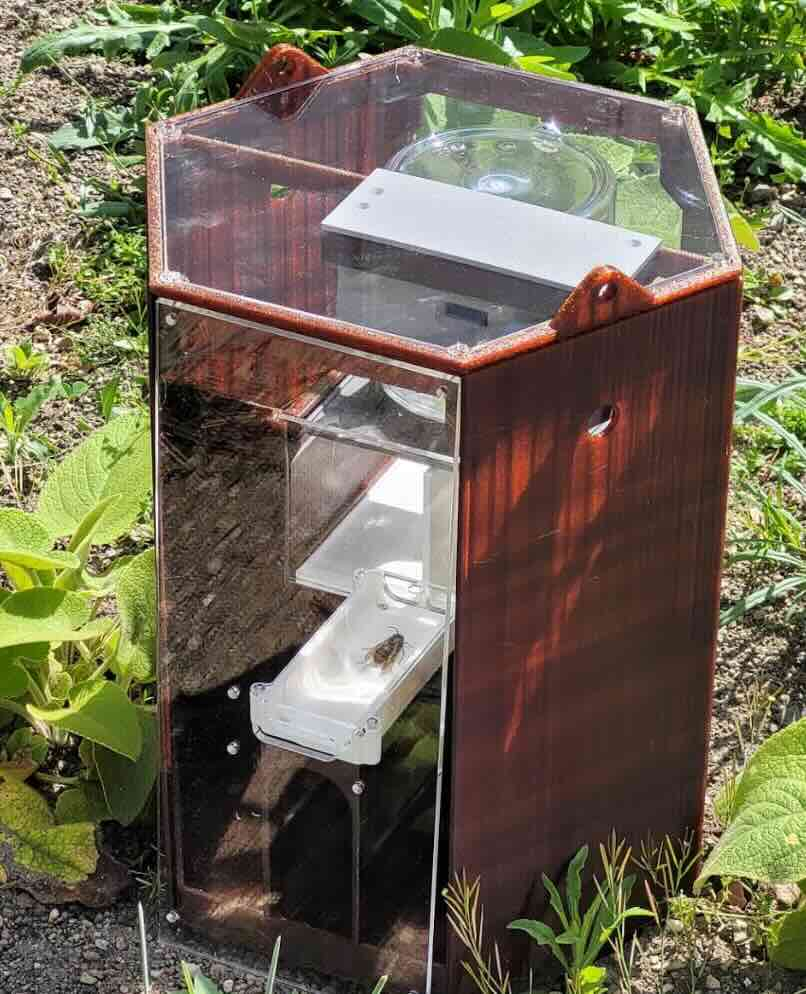

# Vespa Smart Trap

### Edge hornet detection, and how we use Cursor to build it



**Why:** *Vespa velutina* is an invasive hornet that hunts honey bees. A solar-powered trap with a camera can spot them in the field and send sms to the beekeeper at low cost per site.

**Edge, not cloud:** detection runs on the trap. No video stream to upload, no recurring bill.

---

## Pipeline


```text
Image collection  ->  annotation (Grounding DINO)  ->  dataset
        |
        v
Colab: train YOLO11n -> quantize -> VELA conversion
        |
        v
gv2_firmware: integrate model, fix class map, flash GV2
        |
        v
ESP32-S3: receive UART JPEG, validate on bench
        |
        v
LilyGO T-SIM7080G-S3: LTE field alerts (target)
```

---

## Dataset work with Cursor

**Problem:** 36000 of image and label pairs 

**Cursor wrote the tooling in minutes:**

- `dataset_filter_classes/`: keep selected classes, rewrite YOLO `.txt` labels
- `dataset_top_select/`: pick top-down images by filename pattern
- `copied_pairs_review/`: a local web UI to approve or reject image and label pairs

**Result:** reliable changes in the dataset

---

## Firmware with no documentation

**Problem:** the Himax SDK hardcoded COCO class names at compile time. No docs. Swapping in my model meant editing undocumented C++.

**Where Cursor earned its keep:**
- read `gv2_firmware/.../cvapp_yolo11n_ob.cpp` and traced the class map through post-processing
- found the hardcoded label array and the output struct, then wrote the override
- worked inside the submodule without polluting the parent repo history

---

## Where Cursor needs rules

1. **"Just use a Raspberry Pi."** Suggested twice. The trap runs on solar. A Pi idles at 2W.

2. **"Try YOLOv8, it is well supported."** On a 2.4 MB NPU with a custom VELA toolchain. Bold.

3. **It cannot touch the hardware.** Cursor does not flash a board, read a serial port, or notice a loose UART wire. That part is still me.

---

## Takeaways


1. **Cursor is useful at the edge:** dataset tooling, making utils.

2. **Commands** Rules reduce wrong answers, but are soft guidelines. For stubborn mistakes (handling submodules) commands came in handy.

3. **A human stays in the loop, not much vibing at the edge.** 