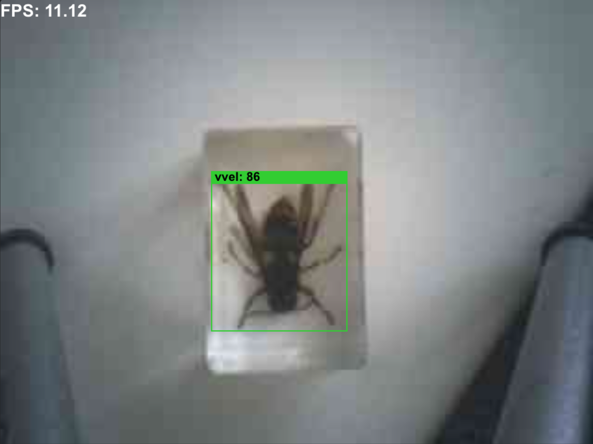
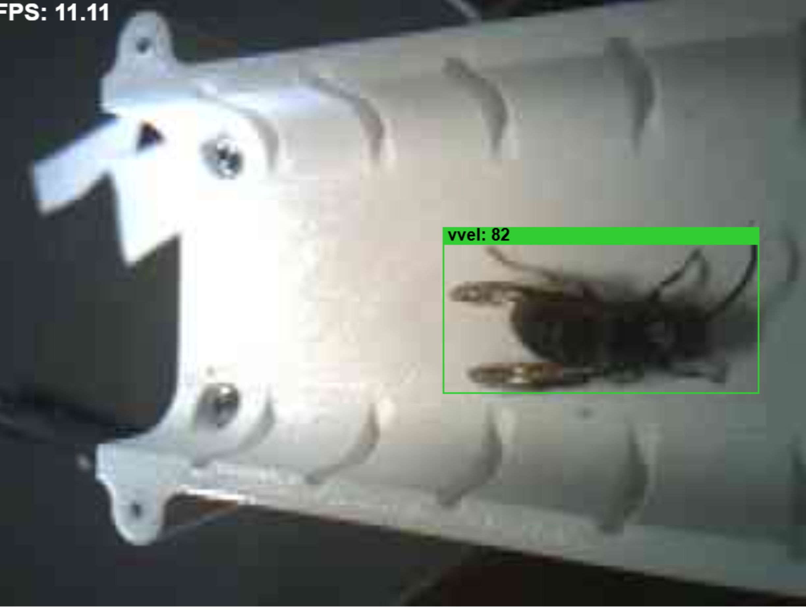

# Vespa Smart Trap

Detects V. velutina, catches it and texts the beekeeper 
- solar powered
- no cloud AI

---

## Why

- *Vespa velutina* threatens bee colonies and other pollinators.
   - Deployment off grid: Solar-powered on-edge detection
   - SMS gives beekeepers time to attach a [tracker](https://www.dronewatch.nl/wp-content/uploads/2024/08/hoornaar-microzender.jpg) to the hornet to trace the nest.

---

## System overview
**Three boards:**
- **camera + Grove Vision AI V2:** vision and AI detection  
- **T-SIM7080G-S3:** power management, cellular connectivity, SMS, SD  
- **Custom PCB:** connects the boards via UART  
 

---

## Detection flow

1. **GV2:**  
   - Detects target  
   - Sends: Class, Confidence, Bounding Box, 224×224 JPEG  
   - Transfer via UART to T-SIM-S3

2. **T-SIM-S3:** 
   - On receive, handles: SMS, SD storage, logs

3. **Actuation:**  
   - If yellowlegged hornet is detected: **left entrance opens:** she can eat and stay 
   - Otherwise: **right entrance** European hornets, wasps, flies can eat and fly away

---

## To make detection flow work

- **Collect Images:** 
   - downloaded from GBIF (~36k) 
- **Annotation of the images:**
   - zero knowledge annotation of the insects in Colab (T4 GPU) 
- **Dataset management:**
   - annotation verification
   - check for duplicates
   - split the images+txt files to train, validation and test sets
- **Make computer vision model:**
   - train yolo11n model with Colab T4
   - int8 quantization
   - vela conversion for GV2 processors
- **GV2 Firmware Adjustments:** 
   - yolo11n adjustments
   - COCO → hornet classes
   - UART payload to T-SIM
- **Flash firmware and model to GV2** 
- **Test on Lilygo and in the trap**
---

## Cursor in this repo

- python scripts
   - dataset handeling
   - test scripts

- firmware
   - get inside in undocumented firmware
   - adjust it: yolo11n, COCO classes -> correct class names -> payload and communication i2C->UART

---

## Cursor challenges

| Challenge| Examples |
| :--- | :--- |
| Wrong hardware suggestions | RPi detector, cloud inference, YOLO on LilyGO ESP32-S3 (inference stays on GV2) |
| Wrong model suggestions | plain `int8.tflite`, YOLO11s (SRAM overflow), SenseCraft swift-yolo, local train instead of Colab |
| Missing documentation | pinouts, UART baud, flash addresses, boot/reset; agent cannot press buttons |
| Hallucinated pipeline | training/quant steps not in `notebooks/*.ipynb` (read-only local SoT) |
| Submodule / git | PR or push to upstream Himax instead of fork (`yolo11-vespa`) |

---

## What I learned when working on edge AI with Cursor

0. Cursor defaults to "common tutorials"

1. **Rules** 
   - Block recurring mistakes (stack, model path, Colab 3.11, anti-hallucination)
   - Soft guardrails: still drift, even with less than 50% of context used

2. **Commands and skills**
   - Repeatable runbooks where rules are not enough

3. **Handling .gitignore and .cursorignore**
   - By default, Cursor glob and search follow `.gitignore` rules.
   - To ensure a path (like `notes/`) is indexed, add an explicit line with a `!` prefix in `.cursorignore` (e.g., `!notes/`)
   - For exact file reading (outside standard search), specify the full path.

